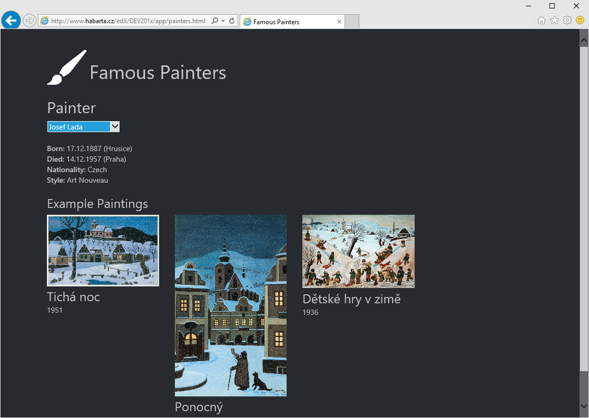

# Famous Painters

Application is located at [this](app/painters.html) address.

It is written using TypeScript, Bootstrap and jQuery.
TypeScript code uses internal modules and is organized this way:

### scripts/data.ts

``` ts
module Data {
    export function loadData(url: string): JQueryPromise<Painter[]> {}
    export class Painter {}
    export class Painting {}
}
```

### scripts/rendering.ts

``` ts
module Rendering {
    export class Renderer {
        renderPainterSelect(painters: Data.Painter[]) {}
        renderPainter(painter: Data.Painter) {}
    }
}
```

### scripts/app.ts

``` ts
window.onload = () => {}
```

## Example screenshots

### Michelangelo


### Josef Lada

